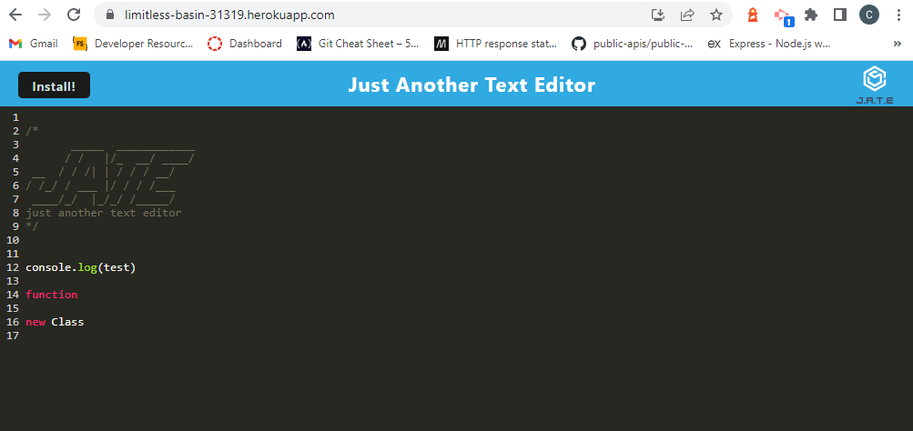
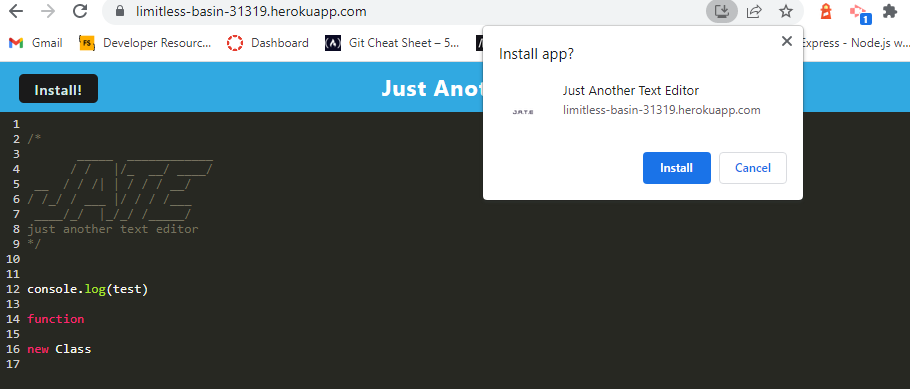

# PWA-Text-Editor  	

## Description

This application was built to demonstrate the ability to install an application and run it locally  without connection to the server
This application was an exercise in better understanding scripts, concurrently, and webpack
The application servers as a simple text editor that can be run offline

## Table of Contents

- [PWA-Text-Editor  	](#pwa-text-editor--)
  - [Description](#description)
  - [Table of Contents](#table-of-contents)
  - [Installation](#installation)
  - [Usage](#usage)
  - [Credits](#credits)
  - [License](#license)
  - [Tests](#tests)
  - [Questions](#questions)

## Installation

The app can be installed from the web by clicking the install button at the top

## Usage

Simply write some text on the screen

## Credits

Starter code was provided by the fullstack bootcamp

## License

This application is covered under the following license: MIT License

## Tests

no tests for this application

## Questions
If you have questions about this application you can reach me for more information here - 

Github: github.com/carechiga

Email: carechiga43@gmail.com